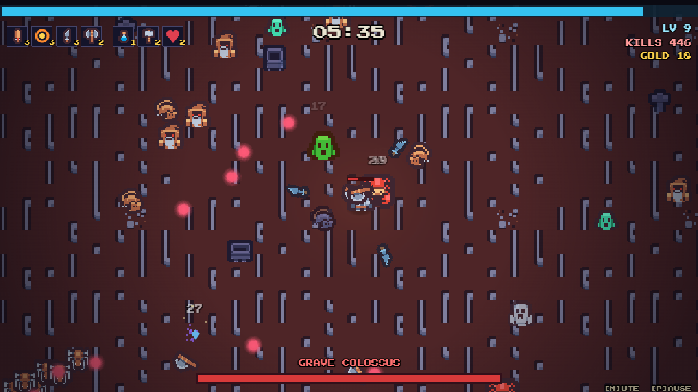
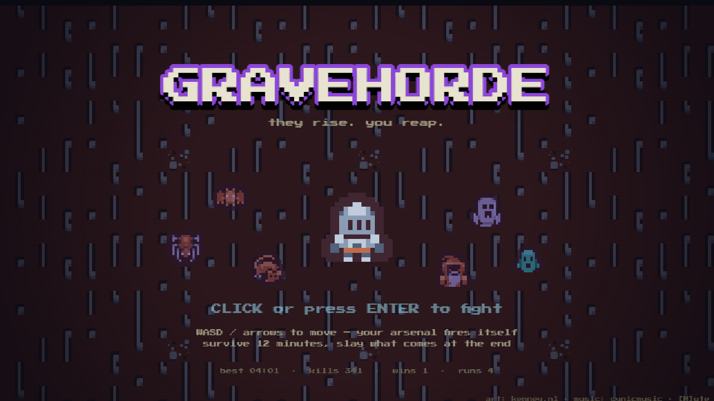

# GRAVEHORDE

> they rise. you reap.

A dark-fantasy **bullet-heaven / survivors-like** for the browser. You are a lone knight in a
cursed graveyard. The dead come in waves for **12 minutes** — survive them, kill the three
bosses, and put Death itself back in the ground.

**▶ Play it: https://mukstoo.github.io/fable-bullet-heaven/**

Built **one-shot** by Claude (Fable 5) with Phaser 3 + TypeScript + Vite.



<details>
<summary>title screen</summary>


</details>

## How to play

| | |
| --- | --- |
| Move | **WASD** or arrow keys |
| Attack | automatic — your arsenal fires itself |
| Choose upgrades | **1/2/3**, arrows + Enter, or click |
| Pause | **P** / Esc |
| Mute | **M** |

Kill enemies → collect the gems they drop → level up → pick one of three boons.
Bosses arrive at **4:00**, **8:00** and **12:00**. Kill the last one to win.

### The arsenal (max 4 weapons)

- **Grave Spark** — arcane bolts at the nearest foe (starter)
- **Reaper's Arc** — sweeping melee arcs with heavy knockback
- **Bone Axes** — lobbed axes that arc overhead and pierce
- **Spirit Blades** — daggers orbiting you
- **Unholy Nova** — radial pulses of grave-fire
- **Stormcall** — lightning on random visible enemies

### Passives (max 4)

Power, cooldown, max HP, move speed, pickup range, armor, regen, and +1 projectile.

### The bestiary

Gravewings, Plague Rats, Grave Oozes, Crypt Spiders, knockback-immune Wraiths,
ranged Grave Acolytes, tanky Tomb Crawlers — plus gold **elites** and three bosses:
the **Grave Colossus** (telegraphed charges), the **Coven Mother** (radial bullet rings),
and **DEATH** (gets faster the longer it lives; enrages if you stall).

## Dev

```bash
npm install
npm run dev        # local dev server
npm run build      # typecheck + production build → dist/
npm run typecheck  # tsc --noEmit only
```

Deploys to GitHub Pages automatically on push to `main` (see `.github/workflows/deploy.yml`).

## Architecture

```
src/
  config.ts            # every balance knob in one place
  data/                # weapons / passives / enemies / wave timeline (pure data)
  entities/            # Player, Enemy (data-driven brains), Projectile — all pooled
  systems/
    RunState.ts        # build, xp/levels, stat recompute, upgrade-choice pool
    Arsenal.ts         # runs all six weapons off the pausable run-clock
    SpawnDirector.ts   # pressure curve, scripted events, spawn ring, leash recycling
    Loot.ts            # gems, magnet sweep, pickups, chests (no physics — distance checks)
    Juice.ts           # damage numbers, particles, ring pulses, slashes, lightning, shake
  scenes/              # Boot (asset gen+load), Title, Game, Hud, LevelUp, Pause, GameOver
```

Design notes:

- **Everything that spawns repeatedly is pooled** (enemies, projectiles, gems, damage text).
  Verified ~57 FPS with 180+ enemies, a boss, and full arsenal on screen.
- **One pausable run-clock** (`GameScene.runTime`) drives every cooldown/timer, so the
  level-up pause can't desync weapon timers or projectile lifespans.
- **Procedural where it glows**: projectile orbs, gems, slash arcs, lightning, vignette and
  icons are canvas/Graphics-generated at boot; only characters/tiles/audio are files.
- Enemy AI is data-driven from `data/enemies.ts`: chasers, drifters (wraiths), ranged
  kiters (acolytes), and per-boss brains in `Enemy.bossBrain`.

## Licensing

Code is MIT. All bundled assets are CC0 except the OFL pixel font — full breakdown with
sources and authors in [CREDITS.md](CREDITS.md).
